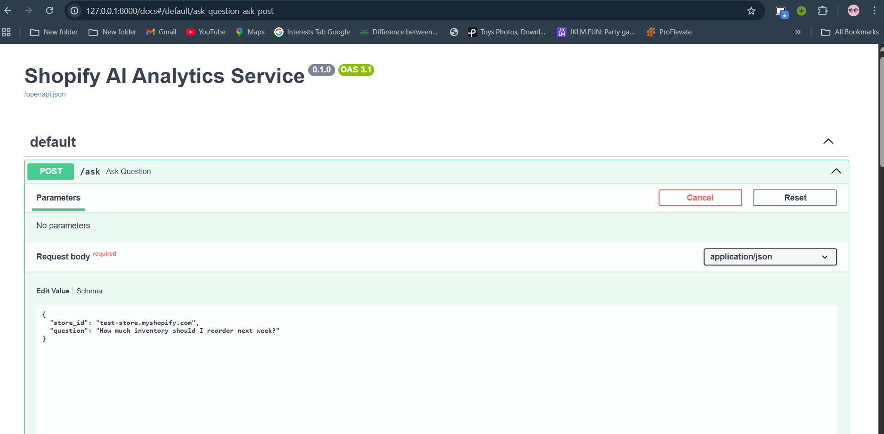
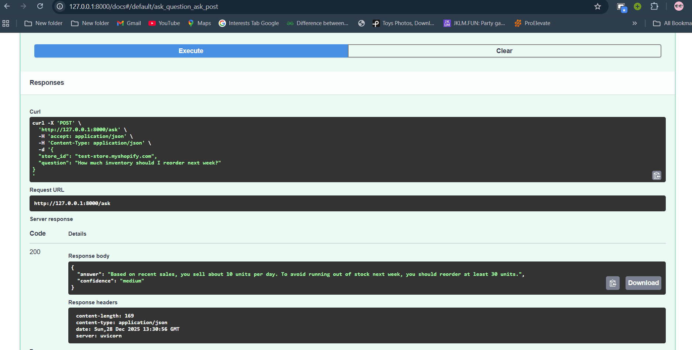
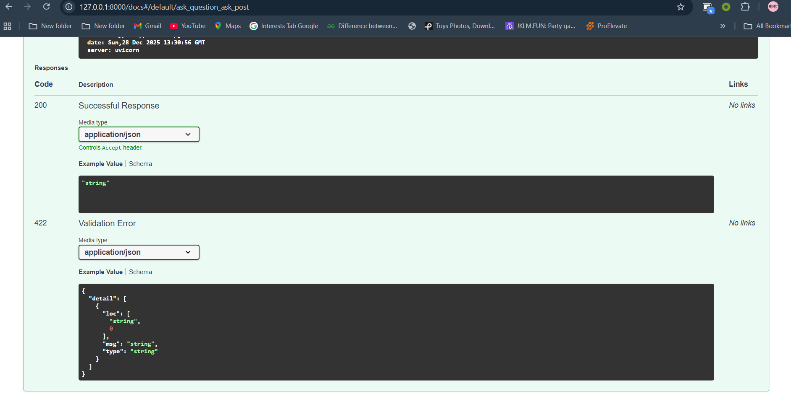

# AI-Powered Shopify Analytics Application

## Overview

This project is a small AI-powered analytics system designed for Shopify stores. It lets users ask natural-language business questions about inventory, sales, and customers. The system translates those questions into ShopifyQL, retrieves data (mocked), and returns concise, business-friendly insights.

Focus: system design, agent reasoning, and clarity (not production hardening).

---

## Architecture

The system is composed of two services:

1. **Rails API (Gateway)**
   - Accepts user questions
   - Validates input
   - Forwards requests to the Python AI service
   - Returns formatted responses

2. **Python AI Service (LLM-powered Agent)**
   - Interprets user intent
   - Plans required analytics data
   - Generates ShopifyQL queries
   - Executes (mocked) Shopify queries
   - Converts results into layman-friendly language

Flow: Client → Rails API → Python AI Agent → ShopifyQL → Business insight

## Architecture Diagram

+--------+        +------------------+        +-------------------+
| Client | -----> |  Rails API       | -----> | Python AI Service |
|        |        |  (Gateway)       |        | (Agent + ShopifyQL)
+--------+        +------------------+        +-------------------+
                                              |
                                              v
                                       ShopifyQL (Mocked)


---

## Tech Stack

- Backend API: Ruby on Rails (API-only)
- AI Service: Python (FastAPI)
- LLM: Mocked / deterministic logic (example flow)
- Shopify Analytics: ShopifyQL (mock execution)
- Communication: HTTP (HTTParty)

---

## API Design

### Endpoint

`POST /api/v1/questions`

### Request body (example)

```json
{
  "store_id": "example-store.myshopify.com",
  "question": "How much inventory should I reorder next week?"
}
```

### Sample response (example)

```json
{
  "answer": "Based on recent sales, you sell about 10 units per day. To avoid running out of stock next week, you should reorder at least 30 units.",
  "confidence": "medium"
}
```

---

## AI Agent Workflow

1. Intent classification — determine whether the question is about inventory, sales, or customers.
2. Query planning — decide tables, metrics, and time ranges.
3. ShopifyQL generation — build syntactically correct ShopifyQL queries.
4. Execution & validation — execute queries (mocked) and validate results.
5. Explanation — convert technical metrics into simple business language.

### Example ShopifyQL

```sql
FROM inventory_levels
SHOW available, sold_per_day
SINCE -30d
```

---

## Error & Ambiguity Handling

If a question lacks sufficient detail, the system requests more info. Example response:

```json
{
  "answer": "Please provide more details such as product name or time range so I can help you better.",
  "confidence": "low"
}
```

---

## Assumptions & Limitations

- Shopify OAuth and API calls are mocked.
- LLM behavior is simulated using deterministic logic.
- Database persistence is not implemented.
- Designed for clarity and reasoning, not production scale.

---

## Future Improvements

- Real Shopify OAuth integration
- Live ShopifyQL execution
- Caching analytics responses
- Conversation memory for follow-up questions
- Retry and fallback logic for the AI agent
- Metrics dashboard UI

---

## Setup Instructions

### Python AI Service (FastAPI)

```bash
cd python-ai
venv\Scripts\activate
uvicorn main:app --reload
```

### Rails API

```bash
cd rails-api
bundle install
rails server
```

---

## Screenshots

### FastAPI AI Service Interface



### Sample Question Request



### Business-Friendly AI Response



---

## Conclusion

This project demonstrates a clean separation of concerns, clear agentic reasoning, and practical handling of analytics workflows for Shopify stores.

## Author

Anshuman Tiwari  
Software Developer
